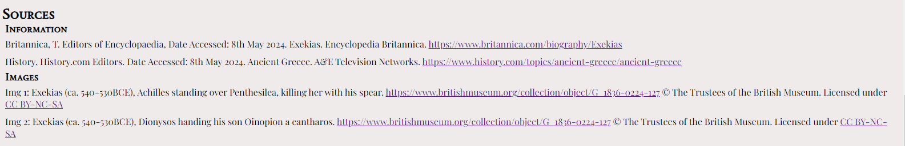

# The Exekias Amphora
The Exekias Amphora website is all about the amphora made by the potter and painter Exekias in the 6th century BC, during the Archaic Period of ancient Greece. More specifically this is the amphora depicting Achilles and Penthesilea, as well as Dionysos and Oinopion.

This website is aimed at individuals who are interested in finding out about ancient artefacts. It provides clear and concise information and presents the sources it was gathered from to allow for more research. Also there is a Feedback section where users can post their criticisms and ideas for the website, as well as a contact section in the footer where all the contact possibilities are listed.

## Features
<ul>
<li><strong>The Header</strong>
    <ul>
    <li>The title clearly states the name of the object that the website is about.</li>
    <li>The font looks similar to ancient writings and contasts well against the background.</li>
    </ul>
</li>

 

<li><strong>Navigation</strong>
    <ul>
    <li>The Navigation bar has the same color as the header which simulates the color of the first image and contrasts with the text.</li>
    <li>Four evenly spaced words that adjust to the size of the screen, clicking on them sends you to: The Amphora, The Mythology, Sources and Feedback sections respectively.</li>
    <li>When hovered over by a cursor, an underline is dislayed under the words to clarify where the user is about to click.</li>
    <li>This helps the user easily find the section of the website that the wish to see.</li>
    </ul>
</li>

 

<li><strong>The Amphora section</strong>
    <ul>
    <li>The Amphora section provides information about the amphora itself, it's creator and it's background.</li>
    <li>This section gives the user the most direct information about the amphora itself, quickly and cleanly presenting it to the user.</li>
    <li>This section has a light-gray background, which while still having good contrast with a black text-color, sets it apart from the surounding sections.</li>
    </ul>
</li>

 

<li><strong>The Mythology section</strong>
    <ul>
    <li>As the the second section focused on providing the user with information, this gives the user information about the stories behind what is depicted on the amphora.</li>
    <li>This information is separated from the previous one, as it is not about the amphora directly, but provides context for the images it displays.</li>
    </ul>
     
</li>

 

<li><strong>The Sources section</strong>
    <ul>
    <li>This section neatly and compactly displays both the image and information sources, so that the user can verify and expand upon their knowledge on the subject.</li>
    <li>The images were provided by an external source under certain conditions, and this both relays those conditions to the user and provides them a link to the license and conditions.</li>
    </ul>
     
</li>

 

<li><strong>The Feedback section</strong>
    <ul>
    <li>The Feedback section allows users to post suggestions for bettering the Website.</li>
    <li>It allows the user to post their First Name, Last Name and Feedback and saves the information.</li>
    <li>All fields must be filled before the form is submitted.</li>
    <li>The form is beneficial in that it allows users to weigh in on the website's design and content.</li>
    </ul>
     
</li>

<li><strong>The Contact section</strong>
    <ul>
    <li>The Contact section both easily desplays and makes the user feel encouraged to get in contact and provides a phone number and email address.</li>
    <li>This section also contains social media icons for the viewer to interact with, that will take them to the Exikas Amphora page either on Facebook, Instagram or Twitter.</li>
    <li>The contact information is useful for the user and allows them multiple options to reach out to the websites owners.</li>
    </ul>
     
</li>

</ul>

## Testing
<ul>
    <li>I confirmed the header, navigation-bar, amphora section, mythology section, sources section, feedback section and contact section were all readable and easily understandable.</li>
    <li>I have confirmed that the form works, all fields are required before the feedback-form can be submitted and the submit button functions properly.</li>
    <li>I verified that the project is responsive and presentable on all standard screen sizes using the devtools device toolbar.</li>
    <li>I have confirmed the page works in multiple browsers.</li>
</ul>

### Bugs
#### Fixed Bugs
<ul>
    <li>When first deployed, I noticed a flicker on the right side of the page when set for the smallest screen. I noticed the images had a margin of 10px on every side, additional to the section. I removed them from the class identifier that was designed to create this margin and the issue was resolved.</li>
    <li>During Testing I saw the text area in the feedback-form was automatically set larger by another browser, causing the submit button to be pushed out of the div. I then set the text area to a specific starting size and the issue was resolved.</li>
</ul>

#### Unresolved Bugs
There are no unresolved Bugs.

### Validator Testing
<ul>
    <li>HTML
        <ul>
            <li>No errors were passed through the official W3C validator.</li>
        </ul>
    </li>
    <li>CSS
        <ul>
            <li>No errors were passed through the official (Jigsaw) validator.</li>
        </ul>
    </li>
    <li>Accessibility
        <ul>
            <li>I confirmed the fonts and colors were easy to read by running it through lighthouse in dev tools.</li>
        </ul>
    </li>
</ul>

## Deployment
<ul>
    <li>This site was deployed by GitHub pages. These are the steps to deploy:
        <ul>
            <li>In the GitHub repository, navigate to the Settings tap</li>
            <li>Under the pages tab in the new menu, select the Main Branch</li>
            <li>Once the Main Branch has been selected, a link to the live page will be provided</li>
        </ul>
    </li>
</ul>

The live link can be found here - <a href="https://cwb-05.github.io/Project-1-Amphora/" target="_blank" rel="noopener">The Exekias Amphora</a>

## Credit
### Code
<ul>
    <li>Wildcard selector, pushing footer down, from CI-Love Running Project</li>
    <li>Image formatting from Example project</li>
    <li>JS for icons in footer from Fontawesome</li>
    <li>Placeholder text "Lorem Ipsum" from https://www.lipsum.com/feed/html</li>
    <li>"overflow-wrap: break-word;" from https://developer.mozilla.org/en-US/docs/Web/CSS/overflow-wrap </li>
</ul>

### Media
<ul>
    <li>Images downloaded from <a href="https://www.britishmuseum.org/collection/object/G_1836-0224-127" target="_blank" rel="noopener">https://www.britishmuseum.org/collection/object/G_1836-0224-127</a>. Copyright: ©
                    The Trustees of the British Museum. Licensed under: <a
                     href="https://creativecommons.org/licenses/by-nc-sa/4.0/" target="_blank" rel="noopener">CC
                        BY-NC-SA</a>
    </li>
    <li>Information from: Britannica, T. Editors of Encyclopaedia, Date Accessed: 8th May 2024.
                    Exekias. Encyclopedia
                    Britannica. <a href="https://www.britannica.com/biography/Exekias" target="_blank"
                        rel="noopener">https://www.britannica.com/biography/Exekias</a>
                         
        History, History.com Editors. Date Accessed: 8th May 2024. Ancient Greece.
                    A&E Television Networks.
                    <a href="https://www.history.com/topics/ancient-greece/ancient-greece" target="_blank"
                        rel="noopener">https://www.history.com/topics/ancient-greece/ancient-greece</a> 
    </li>
</ul>